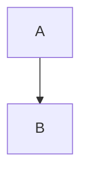

# CLAUDE.md

This file provides guidance to Claude Code (claude.ai/code) when working with code in this repository.

## Project Overview

This is mfyz.com, a personal blog built with Astro framework featuring bilingual content (English/Turkish), MDX blog posts, and modern web technologies.

## Common Development Commands

### Development & Building
- `npm run dev` or `npm start` - Start development server (includes smart server check)
- `npm run build` - Build for production - Don't run build unless you are specifically asked. Build takes time and is not needed for most changes.
- `npm run preview` - Preview production build
- `npm run tunnel` - Expose dev server via ngrok

### Testing & Quality
- `npm test` - Run unit tests with coverage - Always run tests after making changes so you don't break anything. Running tests are fast. If test command exists non-zero it means it failes even though output looks "PASS". If you see non-zero exit code, run tests again with grepping the failure lines to find what's broken and fix them.
- `npm run test:watch` - Run tests in watch mode
- `npm run test:e2e` - Run Playwright end-to-end tests
- `npm run test:e2e:ui` - Run E2E tests with UI
- `npm run check` - TypeScript check (errors only)
- `npm run check:full` - Full TypeScript check with warnings

### Code Quality
- Linting: Uses ESLint with Astro plugin
- Formatting: Prettier with Astro, Tailwind plugins
- Pre-commit: Husky + lint-staged for automated checks
- The project uses TypeScript for type safety

## Architecture & Structure

### Content Management System
- **Content Collections**: Astro's type-safe content system with Zod validation
- **Bilingual Support**: Posts in `src/content/blog/` (English) and `src/content/blog/tr/` (Turkish)
- **Post Metadata**: Title, description, date, tags, imageURL, hidden flag, language
- **Smart Post Filtering**: Advanced filtering by language, visibility, tags via `src/utils/getPosts.ts`

### Key Architectural Patterns
- **Static Site Generation**: Astro builds to static files for optimal performance
- **Component-Based**: Reusable Astro components for consistent UI
- **MDX Integration**: Rich content with React-like components in Markdown
- **Consistent Code Highlighting**: Both MD and MDX files use shared Shiki configuration with Dracula theme
- **RSS Feeds**: Separate feeds for English (`/rss.xml`) and Turkish (`/tr/rss.xml`)
- **OG Image Generation**: Dynamic social media images using Satori
- **Path Aliases**: Import shortcuts (@, @components, @layouts, @content, @utils, @styles)

### Core Utilities
- `src/utils/getPosts.ts` - Central post retrieval with filtering (language, hidden posts, related posts)
- `src/utils/generateOgImage.js` - Dynamic Open Graph image generation
- `src/consts.js` - Site constants and metadata
- `check-server-running.js` - Smart development server management

### OG Image Emoji Support
OG images render a whitelisted set of emojis as Apple emoji PNGs via Satori's `graphemeImages` option. Emojis not in the whitelist will not render (they'll be invisible/blank).

**Whitelisted emojis:** 🪄 ❤️ 🚀 🤔 ⭐ ✅ ⏰ ⏳ 👍 👎 👌

**To add a new emoji:**
1. Find the Unicode codepoint (e.g., `1f600` for 😀)
2. Add the mapping in `src/utils/og-template/post.js` `graphemeImages` object
3. CDN pattern: `https://cdn.jsdelivr.net/npm/emoji-datasource-apple@16.0.0/img/apple/64/{code}.png`
4. Verify by checking the post's `og.png` endpoint

### Rich Content Components
Available for use in MDX posts:
- `ImageZoom` - Zoomable images for screenshots
- `YouTube` - Video embeds
- `CollapsibleText` - Expandable Q&A sections
- `Note` - Highlighted note boxes
- `Rating` - Star rating display
- `Message` - Chat-style message bubbles with avatars

### Mermaid Diagrams
Interactive diagrams and charts with client-side rendering and smart fallback:
- **Native Markdown**: Use standard code blocks with `mermaid` language
- **Client-side rendering**: Loads Mermaid.js from CDN only when needed
- **Graceful fallback**: Failed diagrams remain as syntax-highlighted code blocks
- **Auto-compact pie charts**: Pie charts automatically get optimized spacing

#### Mermaid Styling Options
Add styling options via Mermaid comments on the first line:

````markdown

````

**Available mermaid styling properties:**
- `width=400` - Set custom width (pixels or %, e.g., `width=50%`)
- `height=300` - Set custom height (pixels or %, e.g., `height=200`)
- `center` - Center align the diagram (requires width)
- `align=left|center|right` - Explicit alignment (requires width)
- `border` - Add border, background, and shadow (card style)
- `scale=2.7` - Set custom scale (decimal)
- `scalePos=60%` - Set custom scale X position (percentage) - Only for pie charts

### Styling & Design
- **Framework**: Tailwind CSS with typography plugin
- **Dark Mode**: Class-based dark mode implementation
- **Typography**: Georgia serif for headings (brand requirement), Rubik for body text
- **Animations**: Hover effects, transitions for hero areas
- **Responsive**: Mobile-first design approach

### Deployment & CI/CD
- **Hosting**: Vercel with custom domain configuration
- **Scheduled Posts**: GitHub Actions with PR merge scheduling via `/schedule YYYY-MM-DD HH:MM`
- **E2E Testing**: Playwright tests run on PR/push
- **Performance**: Bundle analysis with rollup-plugin-visualizer

### Development Workflow
- **Content Creation**: MDX files with comprehensive front matter
- **Preview System**: Hidden posts accessible via `?preview=1` query parameter
- **Hot Reloading**: Astro dev server with file watching (may need restart for content collection changes)
- **Type Safety**: TypeScript throughout with strict checking
- **Git Hooks**: Pre-commit linting and formatting
- **Content Collections**: Astro's type-safe content system with automatic language detection
- **Internal Links**: Always use absolute paths without host (e.g., `/post-slug/` not `https://mfyz.com/post-slug/`)
- **Preview URLs**: When user asks for preview URLs, check hostname with `hostname` command:
  - If hostname is `mfyz-remote`: use base URL `https://mfyzcom-remote.mfyz.net/`
  - Otherwise: use `http://localhost:4321/` (Astro's default dev port)
  - Append the post slug and `?preview=1` for hidden posts

### Blog Post Creation Guidelines
When creating new blog posts:
1. **File Location**: Place posts in `src/content/blog/YYYY/` folder where YYYY is the year
2. **File Naming**: Use format `YYYY-MM-DD-slug-name.mdx` (e.g., `2025-09-08-cdn-stacking-proxying-why-bad.mdx`)
3. **Turkish Posts**: Place in `src/content/blog/tr/YYYY/` folder with same naming convention
4. **Date Handling**:
   - If no specific date is given, check current date using `date` command
   - If relative date is described (e.g., "tomorrow", "next week"), calculate from current date
   - Always use the date in both the filename and front matter
5. **Required Front Matter Fields**:
   ```yaml
   ---
   title: "Post Title"
   description: "Post description"
   date: YYYY-MM-DD
   slug: "url-slug"
   tags: ["tag1", "tag2"]
   ---
   ```
6. **Optional Front Matter Fields**:
   - `hidden: true` - For draft posts
   - `language: "tr"` - Automatically set for Turkish posts based on folder
   - `social_post` - Social media announcement text (max 255 chars). Write as a multi-line YAML string (`|`). Should be conversational, hook-driven, and standalone (no links needed). Always include when scheduling posts.
7. **Image Assets Organization**:
   - **Location**: Store images in `public/images/blog/YYYY/` where YYYY is the year
   - **Simple posts (1-3 images)**: Place images directly in the year folder (e.g., `public/images/blog/2025/my-image.jpg`)
   - **Complex posts (4+ images)**: Create a post-specific subfolder (e.g., `public/images/blog/2025/newsletter-digester/screenshot-1.jpg`)
   - **Referencing in posts**: Use absolute paths from public root (e.g., `/images/blog/2025/my-image.jpg`)
   - **Image naming**: Use descriptive, lowercase, hyphen-separated names

### Blog Post Scheduling Workflow

When scheduling a draft blog post from the life vault (or writing a new one), follow these steps:

#### 1. Prepare the repo
```bash
cd ~/Development/mfyz.com
git checkout main && git pull
```

#### 2. Create the post file
- Create the `.mdx` file following the naming/path conventions above
- Include `hidden: true` in front matter (keeps it invisible on the live site)
- Fill all required front matter: `title`, `description`, `date`, `slug`, `tags`
- Use Astro MDX components (`ImageZoom`, `YouTube`, `Note`, etc.) where appropriate

#### 3. Determine the schedule date
- Check open PRs to find the latest already-scheduled post:
  ```bash
  gh pr list --state open
  ```
- PR titles and descriptions use ISO date format (`YYYY-MM-DD`)
- PR descriptions contain `/schedule YYYY-MM-DD` lines
- Find the latest scheduled Tuesday, then pick the **following Tuesday** as the new schedule date
- Posts are generally scheduled on **Tuesdays**

#### 4. Push the hidden draft to main
```bash
git add src/content/blog/YYYY/<post-file>.mdx
git commit -m "Add draft: <post-title>"
git push
```

#### 5. Create the schedule branch and PR
```bash
# Branch name format: YYYY-MM-DD-slug
git checkout -b YYYY-MM-DD-slug
```
- Remove `hidden: true` from the post's front matter
- Commit and push the branch:
  ```bash
  git add src/content/blog/YYYY/<post-file>.mdx
  git commit -m "Schedule: <post-title>"
  git push -u origin YYYY-MM-DD-slug
  ```
- Create the PR with the schedule directive in the description:
  ```bash
  gh pr create --title "YYYY-MM-DD <post-title>" --body "$(cat <<'EOF'
  /schedule YYYY-MM-DDT09:00:00-05:00

  Short description of the post (optional).
  EOF
  )"
  ```

#### 6. Clean up local copy
```bash
git checkout main && git pull
git branch -d YYYY-MM-DD-slug
```

#### 7. Done
A GitHub Action watches for the `/schedule` directive and auto-merges the PR when the scheduled date arrives. No further manual action needed.

#### Quick Reference
| Step             | Branch | `hidden` | Action                    |
|------------------|--------|----------|---------------------------|
| Draft post       | main   | true     | Commit + push to main     |
| Schedule branch  | new    | removed  | Commit + push + create PR |
| Publish          | —      | —        | Auto-merged by GH Action  |

### Language & Internationalization
- **Dual Language**: English (default) and Turkish content
- **Content Structure**: Turkish posts stored in `src/content/blog/tr/` directory
- **URL Structure**: Direct slug URLs without `/tr/` prefix for article detail pages (language determined by file location)
- **Content Detection**: Automatic language detection via folder structure and frontmatter
- **Separate Indexes**: Independent listing pages for each language
- **Translation Style**: Mix English technical terms with Turkish explanations, conversational tone with emojis

### Performance Optimizations
- **Static Generation**: Pre-built pages for fast loading
- **Image Optimization**: Astro's built-in image processing
- **Code Splitting**: Automatic bundle optimization
- **CDN**: Vercel's global edge network
- **Bundle Analysis**: Visual bundle size tracking

## Important Notes

- Always follow the design guidelines in `.windsurfrules` for typography and visual elements
- Maintain Georgia font for headings as a core brand element
- Use the post filtering utilities rather than direct collection queries
- Test both English and Turkish content paths when making changes
- Preview hidden posts with `?preview=1` parameter during development
- The project uses custom remark plugins for emoticons and table of contents