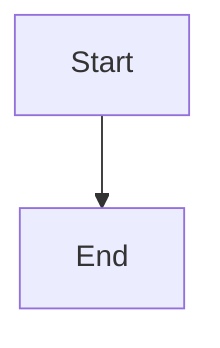

# MFYZ.com

This is the Astro project for mfyz.com blog.

- Built with Astro framework
- Windsurf AI IDE used for both code and content updates. See `.windsurfrules` file for project conventions and design guidelines.
- Post scheduling is done via PR with GitHub Actions
- Interactive Mermaid diagrams with client-side rendering and custom styling options

## Project Conventions

The `.windsurfrules` file contains important design elements and component usage guidelines that must be followed. Key aspects include:

- Transition animations for cover images
- Typography requirements (Georgia font for headings)
- Visual element standards
- Component usage guidelines

## Mermaid Diagrams

The blog supports interactive Mermaid diagrams with client-side rendering. Use standard markdown code blocks with `mermaid` language:

````markdown

````

```

**Styling Options:**
- `width=400` / `height=300` - Custom dimensions
- `center` / `align=left|center|right` - Alignment (requires width)
- `border` - Add card-style border and background
- Pie charts automatically get compact spacing

See `CLAUDE.md` for complete documentation.

## Content Management / Scheduling

Blog posts can be scheduled for publication using GitHub Actions. Create a pull request with the scheduled post and the GitHub Action will automatically publish it at the specified time.

## License

This project is licensed under the MIT License - see the [LICENSE](LICENSE) file for details.

Please provide attribution to original post and author when using any of the written content (blog posts) in this repository.

## References

- Originally derived from https://github.com/pavanbhaskardev/personal-blog-astro
```
