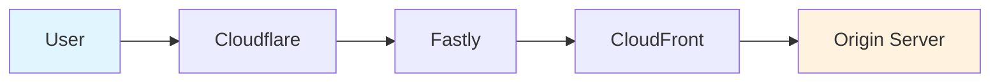
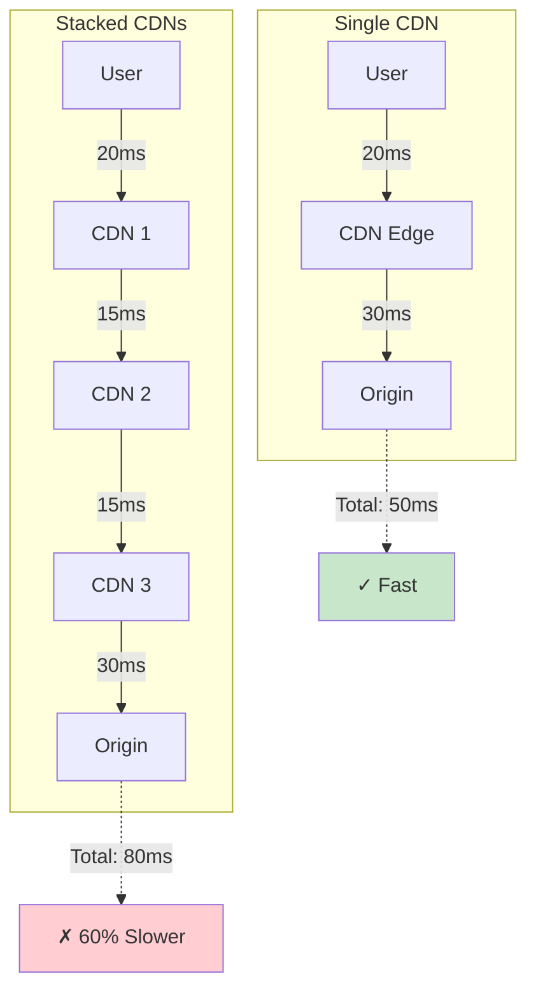
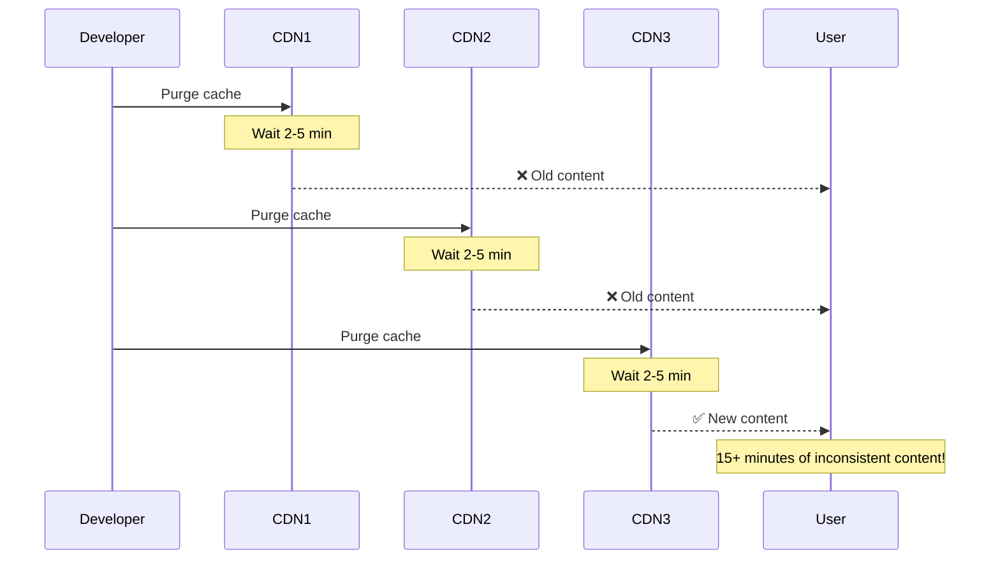
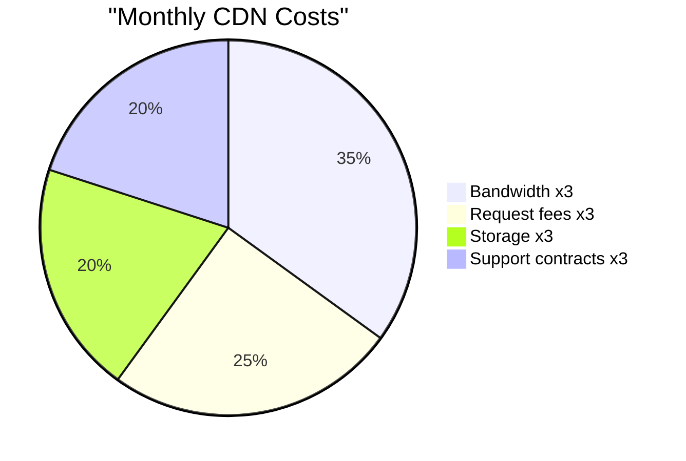
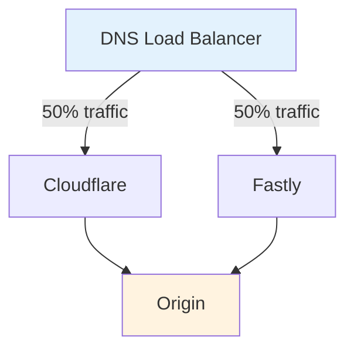
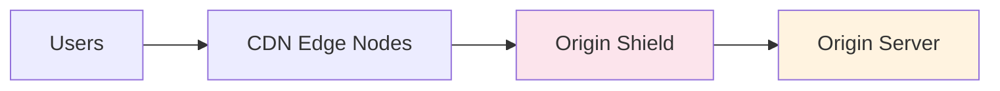
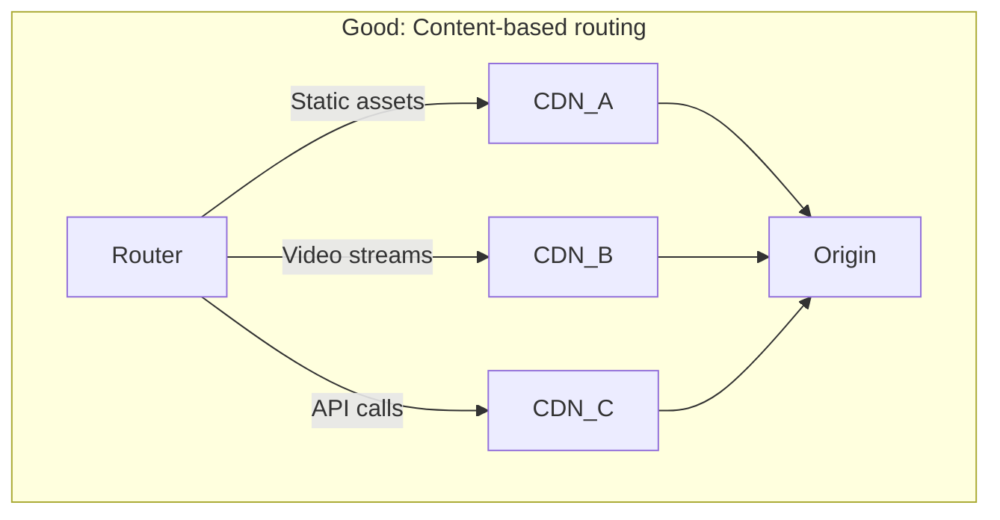
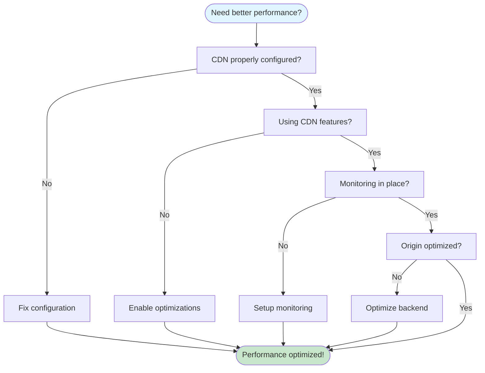

Ever wondered what happens when you try to make your website "super fast" by using multiple CDNs at once? Spoiler: it's like adding more wheels to your car thinking it'll go faster.

## What Is CDN Stacking?

CDN stacking is routing traffic through multiple CDNs in sequence:

People think this gives them the "best of all worlds" – DDoS protection + edge computing + AWS integration. Reality: it's taking three highways to reach one destination.

## The 6 Major Problems

### 1. Increased Latency

### 2. Cache Invalidation Hell

### 3. Debugging Nightmare

Each CDN layer has separate:

- Logs & monitoring dashboards
- Custom headers & error pages
- Rate limiting rules
- Security configurations

Finding one 503 error source = hours of detective work.

### 4. Cost Multiplication

Real example: $8,000/month for stacked CDNs vs $2,000 for single CDN.

### 5. SSL/TLS Certificate Chaos

- Multiple certificate renewals
- Inter-CDN handshake failures
- Extra TLS negotiation time

### 6. Header Corruption

Headers get modified, stripped, duplicated, or reordered. Authentication breaks when CDN #2 strips what CDN #1 adds.

## Real Horror Story

**Black Friday Price Disaster:**

- CDN #1: 1-hour cache
- CDN #2: 30-minute cache
- CDN #3: 2-hour cache

Result: Three different prices shown simultaneously. Millions lost.

## Better Alternatives

### Option 1: Parallel Multi-CDN (Not Stacked!)

### Option 2: Origin Shield Pattern

Reduces origin load without vendor complexity.

### Option 3: Optimize Single CDN

Instead of stacking:

- Configure proper cache headers
- Use edge workers for logic
- Enable HTTP/3
- Set up smart purging

## When Multiple CDNs Make Sense

✅ **Legitimate uses:**

- A/B testing providers (parallel, not stacked)
- Different CDNs for different content types
- Gradual migration periods

## The Right Approach

## Key Takeaways

1. **One well-configured CDN > Multiple stacked CDNs**
2. **Complexity ≠ Performance**
3. **Monitor first, add complexity last**

CDN stacking is like wearing three winter coats – you're not warmer, just unable to move. Keep it simple, configure it well, and your users (and ops team) will thank you.

Have you seen CDN stacking disasters? Share your stories!
