I wanted interactive Mermaid diagrams in my Astro blog but didn't want to deal with build-time complexity. So I built a smart client-side system that detects and transforms standard markdown code blocks into beautiful diagrams automatically.

The solution I ended up with gives me zero build impact with no server-side processing, graceful fallbacks when diagrams fail, progressive enhancement that works without JS, native markdown authoring without component imports, and flexible custom styling control with smart handling for different chart types.

## The Problem I Had

Most Mermaid implementations I found required:

- Build-time processing (slow builds)
- Server-side rendering (complexity)
- Component imports (breaks my markdown flow)

I wanted something simpler.

## My Solution: Smart Client-Side Code Block Replacement

Instead of all that complexity, I detect `mermaid` code blocks and replace them dynamically on the client-side. This gives me zero build impact with no server-side processing, graceful fallbacks when diagrams fail, progressive enhancement that works without JS, native markdown authoring without component imports, and flexible custom styling control with smart handling for different chart types. Bonus: my page SSR still has the source of the diagram which makes it SEO/Agent-friendly.

```javascript
// Detect mermaid code blocks
const mermaidBlocks = document.querySelectorAll(
  'pre[data-language="mermaid"] code'
);

// Replace each with rendered diagram
for (const block of mermaidBlocks) {
  const chartDefinition = block.textContent.trim();

  try {
    // Dynamically load Mermaid only when needed
    const mermaid = await import(
      "https://cdn.jsdelivr.net/npm/mermaid@10.6.1/dist/mermaid.min.js"
    );

    // Render and replace
    const { svg } = await mermaid.render(
      `chart-${Date.now()}`,
      chartDefinition
    );
    block.parentElement.parentElement.innerHTML = svg;
  } catch (error) {
    // Graceful fallback - keep as code block
    console.warn("Mermaid rendering failed, keeping as code block");
  }
}
```

## Need some control over the styling? (size, alignment, border, etc.)

One of the problems with mermaid charts is that you don't know how big/small they will turn up. Mermaid will fill the canvas if you printed only 1 box, or made it super linear flowchart either orientation, it will be unbalanced (too tall, too wide). So I need to be able to control the size and alignment of the chart.

I added styling via Mermaid comments, that gets extracted and styled in the client-side script:

````markdown

````

Parse styling options from the first line:

```javascript
const lines = chartDefinition.split("\n");
if (lines[0].trim().startsWith("%%")) {
  const styleProps = lines[0].trim();

  // Extract properties
  const width = styleProps.match(/width=(\w+)/)?.[1];
  const height = styleProps.match(/height=(\w+)/)?.[1];
  const isCenter = styleProps.includes("center");
  const hasBorder = styleProps.includes("border");

  // Remove style line from chart
  chartDefinition = lines.slice(1).join("\n");
}
```

I added a few styling options to make it more flexible:

| Property | Example       | Description                |
| -------- | ------------- | -------------------------- |
| `width`  | `width=500`   | Custom width in pixels     |
| `height` | `height=300`  | Custom height in pixels    |
| `center` | `center`      | Center align (needs width) |
| `align`  | `align=right` | Explicit alignment         |
| `border` | `border`      | Add border and background  |

## How I Implemented It in Astro

I added this script to my base layout:

```astro
---
// src/layouts/Layout.astro
---

<script is:inline>
  async function initMermaidDiagrams() {
    // Find all mermaid code blocks
    const blocks = document.querySelectorAll(
      'pre[data-language="mermaid"] code'
    );

    if (blocks.length === 0) return;

    try {
      // Load Mermaid dynamically
      if (!window.mermaid) {
        const script = document.createElement("script");
        script.src =
          "https://cdn.jsdelivr.net/npm/mermaid@10.6.1/dist/mermaid.min.js";
        await new Promise((resolve, reject) => {
          script.onload = resolve;
          script.onerror = reject;
          document.head.appendChild(script);
        });
      }

      // Initialize with dark mode support
      const isDark = document.documentElement.classList.contains("dark");
      mermaid.initialize({
        startOnLoad: false,
        theme: isDark ? "dark" : "default",
      });

      // Process each diagram
      for (let i = 0; i < blocks.length; i++) {
        const code = blocks[i];
        const pre = code.parentElement;
        let chart = code.textContent.trim();

        // Parse custom styling
        let width = "",
          height = "",
          align = "",
          border = false;

        if (chart.startsWith("%%")) {
          const [styleLine, ...rest] = chart.split("\n");
          chart = rest.join("\n");

          width = styleLine.match(/width=(\w+)/)?.[1] || "";
          height = styleLine.match(/height=(\w+)/)?.[1] || "";
          align = styleLine.includes("center") ? "center" : "";
          border = styleLine.includes("border");
        }

        // Create container with styling
        const container = document.createElement("div");
        container.className = `mermaid-container my-8`;

        const wrapper = document.createElement("div");
        wrapper.className = `mermaid-diagram rounded-lg min-h-[100px] ${
          border
            ? "border border-gray-200 bg-white p-4 shadow-sm dark:border-gray-700 dark:bg-gray-900"
            : "bg-transparent"
        }`;

        // Apply custom dimensions
        if (width) {
          container.style.width = width.includes("px") ? width : `${width}px`;
          container.style.maxWidth = container.style.width;
        }
        if (height) {
          wrapper.style.height = height.includes("px") ? height : `${height}px`;
        }
        if (align === "center" && width) {
          container.style.margin = "2rem auto";
          container.classList.remove("w-full");
        }

        // Render diagram
        try {
          const { svg } = await mermaid.render(
            `mermaid-${i}-${Date.now()}`,
            chart
          );
          wrapper.innerHTML = svg;

          // Make responsive
          const svgEl = wrapper.querySelector("svg");
          if (svgEl) {
            if (!height) svgEl.style.height = "auto";
            if (!width) svgEl.style.maxWidth = "100%";
          }

          // Replace original code block
          container.appendChild(wrapper);
          pre.parentNode.replaceChild(container, pre);
        } catch (error) {
          console.warn(
            `Mermaid diagram ${i + 1} failed, keeping as code block`
          );
          // Keep original code block on failure
        }
      }
    } catch (error) {
      console.warn("Mermaid library failed to load, keeping code blocks");
    }
  }

  // Initialize on page load and transitions
  document.addEventListener("DOMContentLoaded", initMermaidDiagrams);
  document.addEventListener("astro:page-load", initMermaidDiagrams);
</script>
```

## Example Diagrams

Here's a more complex diagram showing typical development workflow:

```mermaid
%% width=600 center
flowchart TD
  A[New Feature Request] --> B{Understand Requirements?}
  B -->|No| C[Ask Questions]
  C --> B
  B -->|Yes| D[Design Solution]
  D --> E[Write Code]
  E --> F[Local Testing]
  F --> G{Tests Pass?}
  G -->|No| H[Debug & Fix]
  H --> E
  G -->|Yes| I[Code Review]
  I --> J{Review Approved?}
  J -->|No| K[Address Feedback]
  K --> E
  J -->|Yes| L[Deploy to Staging]
  L --> M{Staging Tests Pass?}
  M -->|No| H
  M -->|Yes| N[Deploy to Production]
  N --> O[Monitor]
  O --> P[Done! 🎉]
```



And here's how I spend my day (centered, with a border):


## Beware: Mermaid Isn't Small

One thing to keep in mind - the Mermaid library is pretty hefty at **760KB minified** from the CDN. That's not insignificant for a JavaScript library.

However, my implementation only loads Mermaid conditionally when you actually have Mermaid diagrams on the page. If a blog post has no `mermaid` code blocks, the library never gets downloaded. This keeps your pages fast when you don't need diagrams, but gives you the full power when you do.

The trade-off is worth it for me since I use diagrams sparingly and only where they really add value to the content.

This approach gives me the best of both worlds: simple markdown authoring with powerful interactive diagrams!
