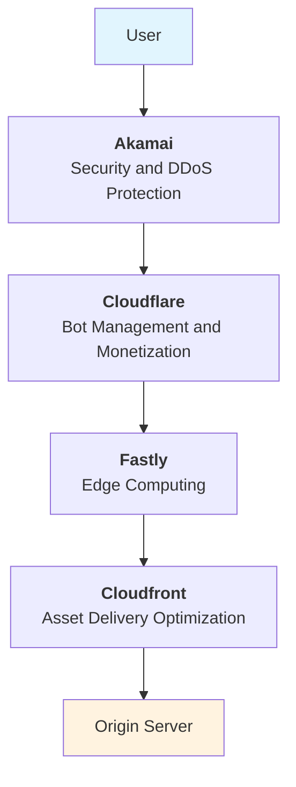
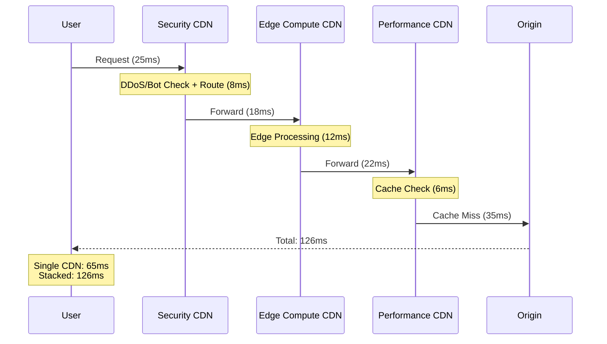
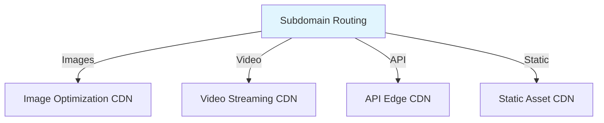

import Image from "@components/Image.astro";
import ImageZoom from "@components/ImageZoom.astro";

CDN stacking is a concept where you maybe using multiple CDNs proxying each other. In a lot of cases you may not even be aware of it. Or if you are aware of it, you may think you're being smart, but it's not. Let me show you why.

I've been working with content delivery architectures for years, I'm seeing this pattern happening more and more. Even when it's done intentionally, it ends up being a performance penalty for what's supposed to be "optimization."

## What is CDN stacking (or proxying)?

I'll give a real life example. I use cloudflare as my main CDN provider, and I use vercel to host most of my hobby apps. Here is the 2 CDN setup looks like:

Cloudflare provides DDoS protection and global distribution, while Vercel handles edge computing and static asset delivery. And Vercel is smart about this setup that detects a CDN in front of it and warns/notifies you about it (regularly). This is generally unintentional, but sometimes it's done intentionally. If this set up was done intentionally, I would imagine the thought process might be:

- I'll use Cloudflare for DDoS protection and edge-based integrations (i.e: 1-click install cookie-consent banner)
- I'll use Vercel CDN for edge computing (i.e: middleware auth function)

Let's take it further with more professional, enterprise approach.

## We want it all!

With more complex apps/experiences, we want all the capabilities. And each CDN provider excels on specific areas. Let's take my hobby project approach further with a setup that usually not how tech teams start designing with, but may end up with, over years, and growing, changing business needs.

Here is an exaggerated story:

- CompanyX tech team uses Akamai for their CDN partner. They implement Akamai's features and optimize their downstream infrastructure to be Akamai-friendly.
- Then they want edge compute and extend their systems, and they see Fastly with more flexible pricing and developer experience features. The implement edge capabilities and customizations with Fastly putting Akamai in front of it.
- Then AI bot traffic trends up, and they see Cloudflare coming up with better bot management and monetization features. business leads wants to use Cloudflare's awesome detection and monetization features. So they put Cloudflare in front of Fastly.
- Then they want to optimize the speed to pull large assets from origin (AWS), and they turn on Cloudfront as the door outside their origin systems.

Looks great, right? Get specialized DDoS protection from one provider. Add edge computing from another. Top it off with native infra provided content optimization.

Every additional layer adds latency and coordination overhead. These are not wordpress plugins. Your CDNs spend more time talking to each other than serving your users.

The analogy I like is, CDNs are like traffic police.

<Image
  src="/images/blog/2025/cdn-stacking/traffic-gabriel-ramos-L0QZ5K7AqP0-unsplash-gray.jpeg"
  alt="Traffic"
  width={800}
>
  Photo by{" "}
  <a href="https://unsplash.com/@gabrieluizramos?utm_content=creditCopyText&utm_medium=referral&utm_source=unsplash">
    Gabriel Ramos
  </a>{" "}
  on{" "}
  <a href="https://unsplash.com/photos/an-aerial-view-of-a-busy-intersection-in-a-city-L0QZ5K7AqP0?utm_content=creditCopyText&utm_medium=referral&utm_source=unsplash">
    Unsplash
  </a>
</Image>

You think you'll solve traffic jam, while catching bad guys, while sending people to correct roads at the same time with adding more traffic police? No, you'll make it worse with more coordination overhead and confusion.

## "Stacking" Awareness and Industry Push Back

This is not new, but the concept, talks, the term "stacking", or "proxying" became more visible. Major CDN providers are distancing themselves from stacking approaches and have more guardrails, or caution to their customers about it. Some have automated reminders, warnings in their dashboards (e.g Vercel detecting stack/proxy).

**Akamai**'s [analysis](https://www.akamai.com/blog/performance/stacking-cdns-for-improved-performance-and-security) is honest: _"Although a multi-CDN strategy can offer significant benefits, it also comes with challenges, such as increased complexity, potential security risks, and higher costs."_

**Fastly**'s [best practices guide](https://www.fastly.com/blog/best-practices-multi-cdn-implementations) is even more direct: _"While a multi-CDN strategy can provide significant benefits, it also introduces complexity."_

These aren't competitors trying to discourage multi-vendor strategies. These are CDN providers acknowledging the performance and operational reality their own customers face.

## Real-World Impact

Let me break down a few key areas how CDN stacking is a problem based on the research and experience I have.

### 1. Cascading Latency Problems

Each hop in your CDN chain adds processing and routing delays. Here is an example:

These processing delays happen on **every request**, including cached content. The performance data confirms this with real measurements showing consistent latency increases as server count grows.

### 2. Careful whitelisting, and recognition of CDN Edge networks to "know each other"

Generally CDNs have security layers that monitors and tries to be smart about traffic that is coming from single (or block of) IP addresses. When you stack CDNs, you have to be really careful the inner CDNs don't block traffic from the upstream CDN computing nodes. Even though these nodes are globally distributed, they are still limited number instances and IP addresses, or blocks. It's very common to see quickly after stacking, the upstream CDN gets blocked by downstream CDNs security layers.

This is a tricky one. You learn this hard way then it creates issues, not easy to upfront knowledge about it.

### 3. Cache Invalidation Nightmare

There is a saying "cache invalidation is the hardest problem in computer science". There are more complex parts in computer science that cache invalidation can be harder. CDN invalidation is generally the easy one. Unless you want to make it harder by stacking CDNs :) In my experience thats what happens with stacking. It's probably the biggest issue with stacking CDNs.

- **Primary CDN**: X seconds (or minutes)
- **Secondary CDN**: Additional Y seconds (or minutes)
- **Tertiary CDN**: Another Z seconds (or minutes)

Either you have to create a cache clearing system that invokes clearing on all CDNs, or you have to wait for X + Y + Z seconds.

Here is a timeline diagram I created for covering cache clearing topic that demonstrates excpicit cache clearing system:

<ImageZoom
  src="/images/blog/2025/cdn-stacking/cache-clearing-example-timeline-automated-cache-clear.jpg"
  alt="Cache Clearing Example"
  width={800}
/>

If you are not doing explicit cache clearing when a content change happens, you're at the mercy of the stars aligning perfectly. In a theoretical world, you can get a few seconds invalidation delay. In reality, you get some combination of \<X + \<Y + \<Z seconds, resulting different, varying and unpredictable content versions across your stack.

<ImageZoom
  src="/images/blog/2025/cdn-stacking/cache-clearing-example-timeline-worst-case-template.jpg"
  alt="Worst Case Cache Refresh Example"
  width={800}
/>

Worst part of this is, each CDN edge node will have different invalidation delay because its local cached object is cached at different time. So it's not just the defaults/TTLs you set, but also the edge node the user is hitting. I'm talking 2 person sitting next to each other and seeing different content. This can happen even with single CDN system between CDN and your origin servers. If you stack multiple CDNs, you're increasing the chance of this happening and increasing unpredictability.

Your business may tolerate this, but many industries, like media/news (the one I'm operating in) where delivering breaking news become challenge, and other industries like e-commerce experiences where customers could view three different prices for the same product during black Friday sales. The trust damage is immediate and lasting.

### 4. Operational Complexity Explosion

Cache clearing example above draws a complexity picture and it's just one thing. Stacking CDNs is not just problem impacts users. It also makes troubleshooting cache, performance issues with stacked CDNs way more complex:

- Different dashboards with incompatible metrics
- Aligning logs (might be in different formats), with proper tracing between systems all the way to origin servers. In some cases doing timestamp detective work to find out what happened.
- CDNs are also complex. within single CDN there are subsystems that needs to provide observability and metrics.
  all of this contributes to your tehcnical teams ability to navigate when an incident happens.

<Image src="/images/blog/this-is-fine.jpg" alt="This is fine" width={800} />

The [RIPE Labs analysis](https://labs.ripe.net/author/sankalp-basavaraj/multi-cloud-multi-cdn-architecture-a-deceptive-future-of-the-internet/) warns that multi-CDN architectures "can create deceptive complexity that may undermine their intended security and reliability advantages if not properly implemented and managed."

### 5. Let's burn some cash

It's obvious that you'll be paying (at minimum) bandwidth traffic on each layer. You must be well-funded company and have extra cash to burn for fun :)

## When Multiple CDNs Actually Make Sense

In my experience, there is still a place for using multiple CDNs at the same time. Spoiler alert: without stacking. There are a few legitimate use cases for multiple CDNs:

### Specialized Content Types

Different CDNs serves different content types, with specific configuration and features:

### Geographic Compliance Requirements

This can be done with single CDN, isolating to different configurations or accounts. But you may choose different CDNs that are geographically more concentrated in target regions (Example: serving both Asia market and Europe market), that may have different regulatory compliance (GDPR, data residency requirements).

### Temporary stacking while transitioning

This is also mixed with "Alternative Origin" feature of CDNs, where you can point to another CDN in front of your origin, to:

- Migrate your experience from to another CDN (example, you may have CDN, caching, edge configurations on your site, that transitioning to a new stack, new CDN that will take time to migrate all the configurations, but don't want to wait the site launch).
- Experimenting with other CDN providers - Testing out new CDN providers, features, configurations, etc.
- Temporarily leverage another CDN's capabilities - although this should not be permanent, like seasonal needs (i.e: world cup or olympics)

## What You Should Actually Do

- **Don't cave in to convenience**, and do the work to configure your single CDN to handle all your needs. Often teams like 2-click setup to connect to another CDN. Not a good idea.
- **Consider operational complexity of stacking CDNs.** How would your team's ability to fix issues, or ship new features will be affected?
- **Add origin shield and protect your origin.** This is how you scale traffic and increase resiliency. Protecting doens't mean cache offload, and reduction of origin traffic only. Adding fallback capabilities in case of failure of downstream systems. Your goal should be always-serve, always-fast. Resiliency should be the #1 priority for your business.
- **Know your tolerance limits**, esp for content refresh times. Sometimes we get into a mode searching the perfection, but you can't always have it, or you don't always need it. Example: You may want to hide the "deal page" on your e-comm store within exact second when it expires. So you lower the TTL, or build a cache clearing system only for this. Do you really needed that? Can't the terms of condition of that deal state that and page disappears after 1 minute past expiration? Don't penalize all users for business needs that can be tolerable with other ways. Setting right expectations sometimes is better than over optimizing, or over engineering.
- **Monitor real user metrics** to identify actual bottlenecks and optimize those.
- **Utilize edge integrations of other solutions** to bring additional capabilities to your single CDN - example adding DataDome (leader in Bot Observability and Management) for Bot traffic protection, or Optimizely for A/B testing on server-side.

Your users don't care how many CDNs power your infrastructure. They care about page load times, and single, properly configured and optimized CDN consistently outperforms stacked CDNs across every measurable metric.

Stop stacking. Start optimizing 😉
