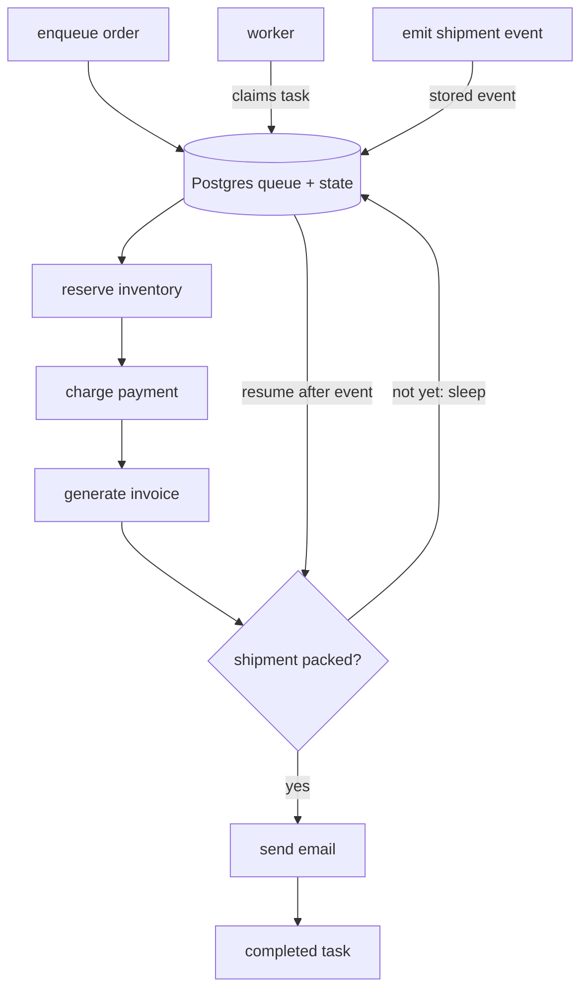

Every other year I find myself figuring out background tasks again.

New stack, new hosting, new deployment shape, new infra constraints. The database choice is almost the only constant. If I get to pick, I default to Postgres.

In 2019, I had a [Heroku queue worker example](/using-heroku-for-a-quick-development-environment/) sitting next to a bunch of tiny Heroku starter repos. In 2020, I wrote about using [GitLab scheduled pipelines as background workers](/using-gitlab-com-as-your-background-workers-using-ci-schedules/), mostly because I wanted scheduled scripts without another daemon to operate.

I have also used Vercel, Netlify, and Cloudflare Workers for different variations of queue and background work management. Most recently, I wrote that [Markdown and JSON are enough](/all-you-need-is-markdown-and-json/) for a surprising amount of personal tooling, then pushed that flat-file idea pretty far with heartbeats, schedules, and agent state all managed in Markdown and JSON files.

Same instinct every time: start with the infrastructure I already have, then add moving parts only when the failure behavior asks for them.

Background work looks simple at first. Put a job somewhere. Run a worker. Mark the job done.

The pain arrives later, when the job fails halfway through a payment, waits for a webhook, retries after a deploy, or needs to prove what already happened.

The queue is rarely the hard part.

The memory is.

## Postgres as a queue is not absurd

Postgres has had the basic ingredients for queue-like workers for a long time. The important one is `SELECT ... FOR UPDATE SKIP LOCKED`.

The [Postgres 18 `SELECT` docs](https://www.postgresql.org/docs/18/sql-select.html) describe `SKIP LOCKED` as a way to avoid lock contention when multiple consumers are reading a queue-like table. The same docs warn that skipped locked rows give you an inconsistent view of the data.

That warning matters. I would not use this as a clever query trick when I need a coherent view of business data. For queue claiming, though, the inconsistency is exactly what makes it useful.

A tiny version looks like this:

```sql
WITH next_job AS (
  SELECT id
  FROM jobs
  WHERE status = 'pending'
  ORDER BY created_at
  LIMIT 1
  FOR UPDATE SKIP LOCKED
)
UPDATE jobs
SET
  status = 'running',
  locked_at = now()
FROM next_job
WHERE jobs.id = next_job.id
RETURNING jobs.*;
```

Run that inside a transaction from multiple workers. One worker locks a row. The other workers skip that locked row and claim different rows. That is basically the trick.

[Crunchy Data has a good walkthrough](https://www.crunchydata.com/blog/message-queuing-using-native-postgresql) of the native Postgres pattern, including the reason `SKIP LOCKED` gives concurrent workers non-overlapping batches. It is a clean teaching example.

But most production queues grow teeth.

You eventually want retries, backoff, dead-letter handling, idempotency, cleanup, inspection tools, schema migrations, and a way to answer "what happened to job 123?" without spelunking through logs.

At that point I would rather use a library than keep extending the little table forever.

## The Postgres queue options

There are already solid Postgres-backed queue options. Absurd is interesting, but it is not the first thing I would reach for when the job is simply "do this one task later."

**PGMQ** is the pure queue comparison. [PGMQ](https://github.com/pgmq/pgmq) gives you an SQS-like queue in Postgres, with visibility timeouts, explicit delete/archive behavior, FIFO support, topic routing, and no external worker service. It currently supports Postgres 14 through 18.

**pg-boss** is the Node/Postgres queue I would compare first. [pg-boss](https://github.com/timgit/pg-boss) uses `SKIP LOCKED` and has the mature things you want in a job queue: transactional enqueue, cron scheduling, automatic retries with backoff, priorities, dead-letter queues, queue policies, a dashboard package, a proxy package, and transaction adapters for ORMs.

**Graphile Worker** is another mature Node/Postgres option. [Graphile Worker](https://github.com/graphile/worker) can run as a library, and its [`addJob()` docs](https://worker.graphile.org/docs/library/add-job) show immediate or delayed jobs, max attempts, job keys for replacement or dedupe behavior, and batch jobs. It also has recurring tasks.

**Solid Queue** is the Rails version of this idea. [Solid Queue](https://github.com/rails/solid_queue/) is configured by default in new Rails 8 apps, supports delayed jobs, concurrency controls, recurring jobs, priorities, pausing queues, and uses `FOR UPDATE SKIP LOCKED` when the database supports it.

The useful baseline is this:

If each job is one unit of work, use a normal queue.

If the job has several durable phases and the phases matter, you are starting to describe a workflow.

## Where Absurd is different

[Absurd](https://github.com/earendil-works/absurd) is different because it is closer to durable workflow execution than a plain message queue.

Armin Ronacher announced it in November 2025 in [Absurd Workflows: Durable Execution With Just Postgres](https://lucumr.pocoo.org/2025/11/3/absurd-workflows/). The design is intentionally small: Postgres stores both the queue and workflow state, most of the durable behavior lives in SQL, and workers pull tasks as they have capacity.

Absurd breaks a task into steps. Each step is a checkpoint. When a step finishes, its result is stored in Postgres. If the worker dies or the task retries, Absurd loads the completed step results and continues from the next step.

It also has sleeps and external events. This is where the code starts to feel different from a normal queue worker.



The task is still ordinary application code. But now the step boundaries are durability boundaries.

That feels very different from "retry the function and hope idempotency catches everything."

## The small example

Here is an example recipe for this shape of workflow. It is intentionally boring:

- Node.js and TypeScript
- `absurd-sdk`
- Postgres through Docker Compose
- `absurdctl` for schema init, queue creation, and task inspection
- plain CLI scripts
- no web UI

The demo task is `order-fulfillment`.

```ts
app.registerTask({ name: "order-fulfillment" }, async (order, ctx) => {
  const inventory = await ctx.step("reserve-inventory", async () => {
    return await reserveInventory(
      order.items,
      `${ctx.taskID}:reserve-inventory`
    );
  });

  const payment = await ctx.step("charge-payment", async () => {
    return await chargePayment(
      order.amountCents,
      `${ctx.taskID}:charge-payment`
    );
  });

  const invoice = await ctx.step("generate-invoice", async () => {
    return await generateInvoice(
      order.orderId,
      `${ctx.taskID}:generate-invoice`
    );
  });

  const shipment = await ctx.awaitEvent(`shipment.packed:${order.orderId}`, {
    stepName: "wait-for-shipment-packed",
  });

  await ctx.step("send-email", async () => {
    return await sendEmail(
      order.customerEmail,
      shipment,
      `${ctx.taskID}:send-email`
    );
  });

  return { inventory, payment, invoice, shipment };
});
```

The external calls in the example are fake. They write to a local JSON file so duplicate side effects are easy to see.

The important detail is the idempotency key. Every external boundary derives a key from `ctx.taskID`, so even if a process overlaps or a retry reaches the same side-effect boundary, the external system has a stable key.

The quickstart is basically:

```bash
npm run db:up
npm run db:init
npm run enqueue
npm run worker
npm run emit:shipment
npm run inspect -- <task-id>
```

There is also a failure demo:

```bash
npm run demo:failure
```

That demo forces `generate-invoice` to fail on the first worker pass. The output looks like this:

```text
First worker pass, with FAIL_STEP=generate-invoice
[side-effect] reserve-inventory created ...
[side-effect] charge-payment created ...
[absurd] task execution failed: Error: Forced failure at generate-invoice

Second worker pass, failure cleared
[side-effect] generate-invoice created ...
```

Notice what is missing from the second pass: `reserve-inventory` and `charge-payment`.

Those steps already committed checkpoints, so Absurd loads their results from Postgres and continues at the failed step. After the shipment event arrives, the task resumes and sends the email.

This is why I find the idea interesting. The queue is only half the story. The task has memory.

## Where I would use it, and where I would not

The sweet spot is a small to medium-size project where Postgres is already the application database. You already trust it with the important state. Letting it hold the queue and workflow checkpoints can be a very reasonable next step.

I would try Absurd when I need durable multi-step work, but I do not want another operations surface yet.

Order fulfillment is the obvious example, but I am more interested in internal and agent-ish workflows: a task that calls an LLM, stores a result, runs a tool, waits for a human or webhook, then continues later. Those workflows are annoying to model as one opaque job because retrying the whole thing can repeat expensive or dangerous work.

I would also consider it for self-hosted products. Requiring Postgres is often fine. Requiring Postgres, Redis, a separate workflow service, a dashboard process, and a new operational model is a much bigger ask.

Absurd's pull-based model fits that mood. Workers poll Postgres. There is no push coordinator calling your HTTP endpoint and no separate orchestration service to stand up before the first workflow works.

I would not use Absurd as a high-volume streaming system.

I would not use it for cross-region queueing.

I would not choose it for a team that needs the most proven queue dashboard, hosted operations, deep framework integration, and years of production folklore today.

And I would be honest about maturity. The [TypeScript SDK README](https://raw.githubusercontent.com/earendil-works/absurd/main/sdks/typescript/README.md) still warns that it is an early experiment and not production-ready. At the same time, Armin's April 2026 follow-up, [Absurd In Production](https://lucumr.pocoo.org/2026/4/4/absurd-in-production/), says Earendil has been running it in production and hardened claim handling, watchdogs, leases, event races, a CLI, and the Habitat dashboard.

That tension is fine. It tells me how to place the tool.

Promising design. Real use by its authors. Still young.

So I would start with the smallest operational surface that gives me the failure behavior I need.

For many jobs, that is a normal Postgres queue. Use PGMQ, pg-boss, Graphile Worker, Solid Queue, or a simple `SKIP LOCKED` table if the job is truly one unit of work.

But when a job has memory, a raw queue starts to leak complexity into your application code. You add state tables. Then retry tables. Then webhook correlation. Then "did this step already run?" checks. Then a script to inspect the mess.

That is the line where Absurd becomes worth exploring.

Not because Postgres should do everything.

Because sometimes Postgres is already the place where the truth lives, and the worker only needs enough memory to keep moving safely.
