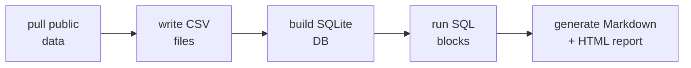

import ImageZoom from "@components/ImageZoom.astro";

AI agents changed what I expect from small data reports.

It is now totally reasonable to hand an agent a CSV and ask for a nice HTML analysis with charts. For quick one-offs, that is hard to beat. But I do not want every report to become the reporting style du jour: a disposable blob of generated HTML.

If I need to rerun the report next week, change one query, inspect the data myself, or reuse a chart in a presentation, I want the repeatable parts to stay repeatable: source CSVs, SQL queries, report templates, and chart generation.

I also do not want the setup to immediately turn into a Python/Jupyter environment, a dashboard app, or a dev server I have to keep running. Those are good tools when the job asks for them. For this shape, they feel heavier than necessary.

And ideally, the whole thing should not need a pile of npm packages just to turn CSVs into tables and SVGs.

So I built a tiny notebook workflow with Markdown, SQLite, CSVs, and plain Node.js.

I made a small public repo for it here: [markdown-data-notebooks](https://github.com/mfyz/markdown-data-notebooks). The generated report has a [Markdown version GitHub can preview directly](https://github.com/mfyz/markdown-data-notebooks/blob/main/reports/weather_report.md), and an [HTML version hosted on GitHub Pages](https://mfyz.github.io/markdown-data-notebooks/reports/weather_report.html).

## The shape I wanted

I wanted something that felt like a notebook, but stayed close to normal developer tooling.

The workflow should be:



That is it.

No dashboard server. No notebook runtime. No database service. No npm dependencies. Just a local repo with scripts and templates.

The approach I came up with is simple: Markdown is the document surface, SQLite is the query engine, and CSVs are input tables. Because SQLite sits in the middle, the data can be one CSV or multiple CSVs joined together. The output blocks can be tables or charts, but the report stays described in plain Markdown.

Here is how that looks. A table is a fenced SQL block inside the Markdown file:

````markdown
```sql:table
SELECT
  city AS "City",
  avg_temp_c AS "Avg C",
  total_precipitation_mm AS "Rain mm"
FROM location_weather_summary
ORDER BY avg_temp_c DESC
```
````

The generator executes that SQL against the local SQLite database and replaces the block with a Markdown table. The same idea works for charts:

````markdown
```sql:bar-chart(title="Average temperature by city")
SELECT
  city AS label,
  avg_temp_c AS value
FROM location_weather_summary
ORDER BY avg_temp_c DESC
```
````

This is not a new idea. Literate programming, notebooks, static site generators, and SQL-based BI tools all orbit around the same pattern. What I wanted was a tiny version that fits in a repo and can be understood in one sitting.

## Why weather data

I wanted demo data that was public, familiar, and still interesting enough for charts. Weather is perfect for that.

The seed script pulls city metadata from the [Open-Meteo Geocoding API](https://open-meteo.com/en/docs/geocoding-api), then pulls daily 2024 weather data from the [Open-Meteo Historical Weather API](https://open-meteo.com/en/docs/historical-weather-api). That gives the repo two CSV files:

- `locations.csv` has city, country, coordinates, timezone, elevation, and population.
- `daily_weather.csv` has one row per city per day with weather code, temperature, precipitation, and wind speed.

Those two files give enough shape to demonstrate joins, filters, summaries, tables, bar charts, and pie charts without needing a private export.

The first summary table is basic, but that is exactly the point. A couple of local CSV files are enough to ask useful questions.

<ImageZoom
  src="/images/blog/2026/markdown-data-notebooks/chart-03-average-temperature-by-city.svg"
  alt="Bar chart showing average 2024 temperature by city for Singapore, Cairo, Buenos Aires, Tokyo, Istanbul, New York, London, and Reykjavik"
/>

This is the kind of chart I want in a report. Not a full dashboard, not a visualization project. Just enough visual structure to make the pattern obvious.

## The database step

The project uses SQLite as the small query engine in the middle.

Historically I would have reached for `better-sqlite3` or `sql.js`. Both are good choices. For this experiment, though, I wanted the repo to be completely dependency-free, so I used Node's built-in [`node:sqlite`](https://nodejs.org/api/sqlite.html) module.

That choice has a trade-off. `node:sqlite` is available in modern Node, but it is still relatively new. For a production package, I would think harder about version support and whether an established SQLite package is the better bet. For a small demonstration repo, having zero npm packages is nice.

The database build step reads every CSV in `data/source`, creates a table for each one, infers basic column types, inserts the rows, and then creates a few views:

```text
daily_weather
locations
weather_daily_enriched
location_weather_summary
monthly_weather_summary
condition_summary
```

The join happens in `weather_daily_enriched`:

```sql
SELECT
  w.location_id,
  l.city,
  l.country,
  w.date,
  w.weather_code,
  w.temp_mean_c,
  w.precipitation_mm
FROM daily_weather w
JOIN locations l ON l.location_id = w.location_id
```

Once the data is in SQLite, the rest of the workflow is normal SQL.

## Charts are just SVG files

I did not want to pull in a charting library for this. The report generator has two small SVG helpers: one for horizontal bar charts, one for pie charts.

That is intentionally limited. But limited is fine here.

This report does not need hover states, legends, filters, or drill-downs. It needs a few charts that render in Markdown/HTML and can be committed with the report.

Here is the monthly precipitation chart generated from the `monthly_weather_summary` view:

<ImageZoom
  src="/images/blog/2026/markdown-data-notebooks/chart-02-total-precipitation-by-month.svg"
  alt="Bar chart showing total precipitation by month across the demo weather dataset"
/>

The SQL behind it is simple:

```sql
SELECT
  month AS label,
  ROUND(SUM(precipitation_mm), 1) AS value
FROM monthly_weather_summary
GROUP BY month
ORDER BY month
```

That is the part I like. The chart is not configured somewhere else. It lives next to the explanation, inside the report template.

## The report is static

The generator writes two files:

```text
reports/weather_report.md
reports/weather_report.html
```

The Markdown version is useful in the repo. The HTML version is useful for sharing. Since the output is static, GitHub Pages can host it without any server code.

The generated outputs are here:

- [Markdown report previewed by GitHub](https://github.com/mfyz/markdown-data-notebooks/blob/main/reports/weather_report.md)
- [HTML report hosted on GitHub Pages](https://mfyz.github.io/markdown-data-notebooks/reports/weather_report.html)

That makes the workflow easy to explain:

```bash
npm run seed
npm run report
```

Then commit the generated report if you want to publish it.

## Where this fits

I would reach for this when the job is recurring but still small.

That could be weekly exports, public datasets, simple analytics, operational summaries, or reports where the question is mostly "what changed?" or "what are the top patterns?" The report itself stays reviewable too: the template is Markdown, the SQL is visible, the generated report is a file, and the charts are SVGs.

The weather condition distribution is a good example. It is not trying to be fancy. It gives a quick shape of the dataset, which is usually enough for a report you want to read, not operate.

<ImageZoom
  src="/images/blog/2026/markdown-data-notebooks/chart-01-weather-condition-distribution.svg"
  alt="Pie chart showing distribution of weather condition groups in the demo weather dataset"
/>

This is not a replacement for Jupyter. If you need interactive exploration, statistical notebooks, rich plotting, or a data science workflow, use the real thing. It is also not a dashboard. There is no live filtering, no user accounts, no refresh loop, and no incremental query engine behind a UI.

SQL inside Markdown can get ugly if you let it. My rule would be: keep the template queries readable. If the SQL starts turning into an application, move that complexity into views or scripts. Same with CSV parsing: this repo handles normal quoted CSV, but if the input format gets hostile, use a real CSV library.

The reason I like this pattern is not that it is technically impressive. It is the opposite. I can read the scripts, inspect the CSVs, run the SQL manually, and open the generated Markdown or HTML report without keeping anything alive in the background.

I will probably keep this as a small starter for future CSV-heavy posts. It sits in a nice middle ground: more repeatable than a spreadsheet, much lighter than a notebook environment, and plain enough that the whole thing can live in Git.
