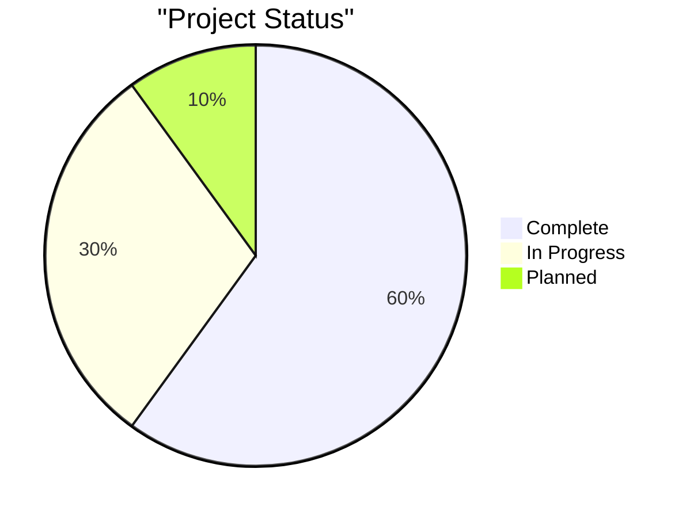
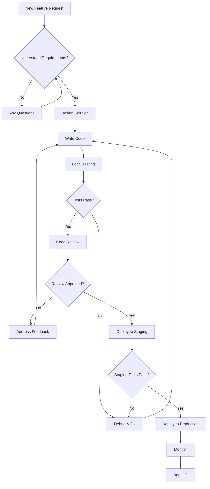
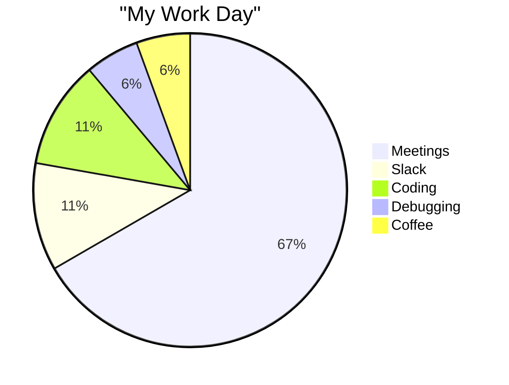

Astro blogumda etkileşimli Mermaid diyagramları istiyordum ama build sürecini karmaşıklaştırmak hiç istemiyordum. Bu yüzden standart markdown kod bloklarını algılayıp sayfa açıldığında diyagrama çeviren akıllı bir client-side yapı kurdum.

Günün sonunda elimde şu vardı: build tarafında sıfır ek yük, server-side render karmaşası yok, diyagram patlarsa düzgün fallback var, JavaScript kapalıysa içerik yine okunabiliyor ve markdown içinde component import etmek zorunda kalmıyorum. Bonus tarafı da şu: SSR çıktıda diyagramın kaynak metni durduğu için SEO ve agent dostu bir yapı da çıkmış oluyor.

## Problem

Karşıma çıkan Mermaid çözümlerinin çoğu şunları istiyordu:

- Build time işleme (yavaş build)
- Server-side render mantığı (gereksiz karmaşa)
- Component import etme zorunluluğu (markdown akışımı bozuyor)

Ben daha sade bir şey istiyordum.

## Çözümüm: Kod Bloklarını Client-Side Diyagrama Çevirmek

Tüm bu ekstra yapılarla uğraşmak yerine `mermaid` kod bloklarını bulup tarayıcı tarafında dinamik olarak değiştiriyorum. Böylece build tarafında ek maliyet olmuyor, diyagram render edilemezse içerik kod bloğu olarak kalıyor, progressive enhancement korunuyor ve markdown yazarken doğal akış bozulmuyor.

Bir de benim hoşuma giden tarafı şu: sayfanın SSR çıktısında diyagramın kaynak hali kaldığı için içerik düz metin olarak da anlamlı. Bu da arama motorları ve çeşitli agent'lar için baya işe yarıyor.

Markdown post'larımda kullandığım örnek Mermaid bloğu şu şekilde:

````markdown

````

Sonra da bu blokları bulup Mermaid'i CDN üzerinden gerektiğinde yüklüyor ve anlık olarak render ediyorum:

```javascript
// Mermaid kod bloklarını bul
const mermaidBlocks = document.querySelectorAll(
  'pre[data-language="mermaid"] code'
);

// Her birini render edilmiş diyagram ile değiştir
for (const block of mermaidBlocks) {
  const chartDefinition = block.textContent.trim();

  try {
    // Mermaid'i sadece gerektiğinde dinamik yükle
    const mermaid = await import(
      "https://cdn.jsdelivr.net/npm/mermaid@10.6.1/dist/mermaid.min.js"
    );

    // Render et ve değiştir
    const { svg } = await mermaid.render(
      `chart-${Date.now()}`,
      chartDefinition
    );
    block.parentElement.parentElement.innerHTML = svg;
  } catch (error) {
    // Render edilemezse kod bloğu olarak kalsın
    console.warn("Mermaid rendering failed, keeping as code block");
  }
}
```

## Biraz Stil Kontrolü Lazım mı? (boyut, hizalama, border vs.)

Mermaid diyagramlarında en gıcık taraflardan biri şu: çıktı boyutunun nasıl davranacağını baştan kestirmek zor. Tek kutuluk çok basit bir akış da çizseniz, aşırı yatay bir flowchart da çizseniz ortaya bazen fazla geniş, bazen fazla uzun bir görüntü çıkabiliyor.

Ben de bu yüzden diyagramın boyutunu ve hizalamasını kontrol etmek istedim. Bunun için Mermaid yorum satırlarını kullanarak küçük stil ipuçları ekledim. Script bu satırı okuyup gerekli stilleri uyguluyor.

````markdown

````

İlk satırdaki stil seçeneklerini şöyle parse ediyorum:

```javascript
const lines = chartDefinition.split("\n");
if (lines[0].trim().startsWith("%%")) {
  const styleProps = lines[0].trim();

  // Özellikleri çıkar
  const width = styleProps.match(/width=(\w+)/)?.[1];
  const height = styleProps.match(/height=(\w+)/)?.[1];
  const isCenter = styleProps.includes("center");
  const hasBorder = styleProps.includes("border");

  // Stil satırını diyagram tanımından çıkar
  chartDefinition = lines.slice(1).join("\n");
}
```

Biraz daha esnek olsun diye birkaç stil seçeneği ekledim:

| Özellik  | Örnek         | Açıklama                       |
| -------- | ------------- | ------------------------------ |
| `width`  | `width=500`   | Piksel cinsinden genişlik      |
| `height` | `height=300`  | Piksel cinsinden yükseklik     |
| `center` | `center`      | Ortala (genişlik ile birlikte) |
| `align`  | `align=right` | Açık hizalama belirt           |
| `border` | `border`      | Kenarlık ve arka plan ekle     |

## Astro İçinde Nasıl Kullandım?

Bunu base layout dosyama ekledim:

```astro
---
// src/layouts/Layout.astro
---

<script is:inline>
  async function initMermaidDiagrams() {
    // Tüm Mermaid kod bloklarını bul
    const blocks = document.querySelectorAll(
      'pre[data-language="mermaid"] code'
    );

    if (blocks.length === 0) return;

    try {
      // Mermaid'i dinamik yükle
      if (!window.mermaid) {
        const script = document.createElement("script");
        script.src =
          "https://cdn.jsdelivr.net/npm/mermaid@10.6.1/dist/mermaid.min.js";
        await new Promise((resolve, reject) => {
          script.onload = resolve;
          script.onerror = reject;
          document.head.appendChild(script);
        });
      }

      // Dark mode desteği ile başlat
      const isDark = document.documentElement.classList.contains("dark");
      mermaid.initialize({
        startOnLoad: false,
        theme: isDark ? "dark" : "default",
      });

      // Her diyagramı işle
      for (let i = 0; i < blocks.length; i++) {
        const code = blocks[i];
        const pre = code.parentElement;
        let chart = code.textContent.trim();

        // Özel stilleri parse et
        let width = "",
          height = "",
          align = "",
          border = false;

        if (chart.startsWith("%%")) {
          const [styleLine, ...rest] = chart.split("\n");
          chart = rest.join("\n");

          width = styleLine.match(/width=(\w+)/)?.[1] || "";
          height = styleLine.match(/height=(\w+)/)?.[1] || "";
          align = styleLine.includes("center") ? "center" : "";
          border = styleLine.includes("border");
        }

        // Stil uygulanacak container'ı oluştur
        const container = document.createElement("div");
        container.className = `mermaid-container my-8`;

        const wrapper = document.createElement("div");
        wrapper.className = `mermaid-diagram rounded-lg min-h-[100px] ${
          border
            ? "border border-gray-200 bg-white p-4 shadow-sm dark:border-gray-700 dark:bg-gray-900"
            : "bg-transparent"
        }`;

        // Özel boyutları uygula
        if (width) {
          container.style.width = width.includes("px") ? width : `${width}px`;
          container.style.maxWidth = container.style.width;
        }
        if (height) {
          wrapper.style.height = height.includes("px") ? height : `${height}px`;
        }
        if (align === "center" && width) {
          container.style.margin = "2rem auto";
          container.classList.remove("w-full");
        }

        // Diyagramı render et
        try {
          const { svg } = await mermaid.render(
            `mermaid-${i}-${Date.now()}`,
            chart
          );
          wrapper.innerHTML = svg;

          // Responsive davranış ekle
          const svgEl = wrapper.querySelector("svg");
          if (svgEl) {
            if (!height) svgEl.style.height = "auto";
            if (!width) svgEl.style.maxWidth = "100%";
          }

          // Orijinal kod bloğunu değiştir
          container.appendChild(wrapper);
          pre.parentNode.replaceChild(container, pre);
        } catch (error) {
          console.warn(
            `Mermaid diagram ${i + 1} failed, keeping as code block`
          );
          // Hata olursa orijinal kod bloğu kalsın
        }
      }
    } catch (error) {
      console.warn("Mermaid library failed to load, keeping code blocks");
    }
  }

  // Sayfa yüklenince ve geçişlerde çalıştır
  document.addEventListener("DOMContentLoaded", initMermaidDiagrams);
  document.addEventListener("astro:page-load", initMermaidDiagrams);
</script>
```

## Örnek Diyagramlar

Daha karmaşık bir geliştirme akışı örneği şöyle:



Bir de günümün çoğunun nereye gittiğini anlatan şu örnek var (ortalanmış, border'lı):



## Dikkat: Mermaid Küçük Bir Kütüphane Değil

Şunu da akılda tutmak lazım: Mermaid kütüphanesi CDN'den geldiğinde **760KB minified** civarında. JavaScript tarafı için bu küçük bir yük değil.

Ama benim kullanımımda kritik nokta şu: bu dosya sadece sayfada gerçekten `mermaid` kod bloğu varsa yükleniyor. Yazıda hiç Mermaid yoksa kütüphane hiç indirilmiyor. Dolayısıyla ihtiyaç olmayan sayfalarda performansı boş yere aşağı çekmiyorsunuz.

Benim için bu trade-off mantıklı. Diyagramları çok sık kullanmıyorum ve kullandığım yerlerde de gerçekten değer katıyorlar.

Sonuç olarak elimde iki güzel şey kaldı: markdown yazımı sade kaldı, diyagram tarafı da güçlü ve etkileşimli hale geldi. Tam istediğim buydu.
